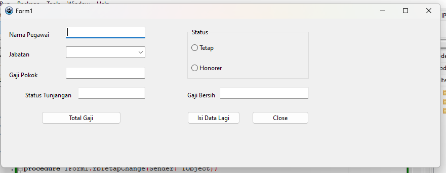

| Nama       | Faris Syahluthfi               |
| ---------- | ------------------------------ |
| NIM        | 312010034                      |
| Kelas      | TI.20.RPL-1                    |
| Mata Kuliah| Pemrograman Visual             |
| Dosen      | Agung Nugroho, S.Kom., M.Kom.  |

## Latihan
# 1. Program Menghitung Gaji Karyawan

<li>Tampilan Utama Program</li> 

<li>Menghitung Gaji Bersih Direktur Tetap</li> 

<li>Menghitung Gaji Bersih Manager Tetap</li> 

<li>Menghitung Gaji Bersih Karyawan Tetap</li> 

